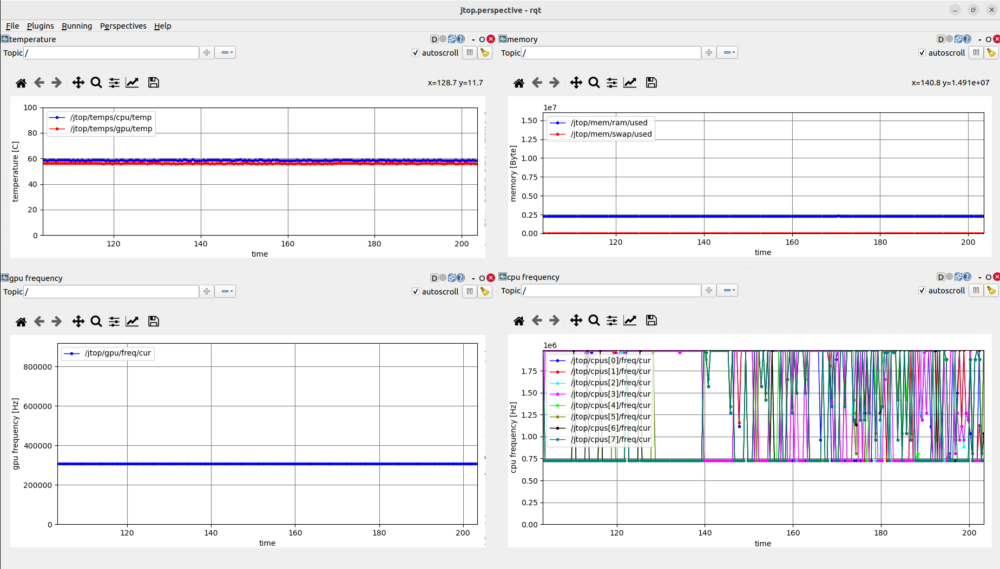

# ros2_jtop
ROS2 package to monitor jetson resources. 

This was tested on Jetson Orin NX 16GB with;
- Jetpack 6.0 [L4T 36.3.0]
- ROS 2 Humble 

 

## Usage
```
ros2 launch ros2_jtop jtop.launch.py
```

## Published Topic
- *`/jtop:`* (jtop_orinnx_msgs/msg/Jtop)  

## Required Param
- *`interval`* (double, default: 0.5)  
  **Description**:  jtop frequency in seconds  

- *`max_num_cpus`* (integer, default: 8)  
  **Description**:  the number pf cpu cores (e.g. 8 cores for Jetson Orin NX 16GB)  
